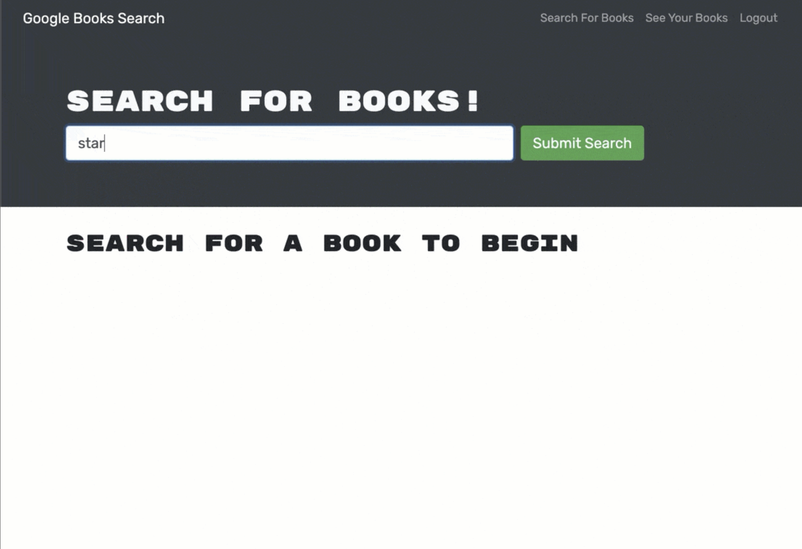

[](https://opensource.org/licenses/MIT)

<br />
<p align="center">

<h3 align="center" id="book-search-engine">Book Search Engine</h3>

<p align="center">
As an avid reader, I want to search for new books to read so that I can keep a list of books to purchase.
<br />
<a href="#how-to-download"><strong>Explore the docs »</strong></a>
<br />
<br />
<a href="#example">View Demo</a>
.
<a href="https://github.com/griffondean/book-search/issues">Report Bug</a>
·
<a href="https://github.com/griffondean/book-search/issues">Request Feature</a>
</p>
</p>
<br />
<br />

<details open="open">
<summary>Table of Contents</summary>
<ul>
<li><a href="#description">Description</a></li>
<li><a href="#technologies">Technologies</a></li>
<li><a href="#how-to-download">Download</a></li>
<li><a href="#installation">Installation</a></li>
<li><a href="#prerequisites">Prerequisites</a></li>
<li><a href="#usage">Usage</a></li>
<li><a href="#contributing">Contributing</a></li>
<li><a href="#questions">Questions</a></li>
<li><a href="#license">License</a></li>
</ul>
</details>

---

## Description

GIVEN a book search engine

- WHEN I load the search engine
- THEN I am presented with a menu with the options Search for Books and Login/Signup and an input field to search for books and a submit button
- WHEN I click on the Search for Books menu option
- THEN I am presented with an input field to search for books and a submit button
- WHEN I am not logged in and enter a search term in the input field and click the submit button
- THEN I am presented with several search results, each featuring a book’s title, author, description, image, and a link to that book on the Google Books site
- WHEN I click on the Login/Signup menu option
- THEN a modal appears on the screen with a toggle between the option to log in or sign up
- WHEN the toggle is set to Signup
- THEN I am presented with three inputs for a username, an email address, and a password, and a signup button
- WHEN the toggle is set to Login
- THEN I am presented with two inputs for an email address and a password and login button
- WHEN I enter a valid email address and create a password and click on the signup button
- THEN my user account is created and I am logged in to the site
- WHEN I enter my account’s email address and password and click on the login button
- THEN I the modal closes and I am logged in to the site
- WHEN I am logged in to the site
- THEN the menu options change to Search for Books, an option to see my saved books, and Logout
- WHEN I am logged in and enter a search term in the input field and click the submit button
- THEN I am presented with several search results, each featuring a book’s title, author, description, image, and a link to that book on the Google Books site and a button to save a book to my account
- WHEN I click on the Save button on a book
- THEN that book’s information is saved to my account
- WHEN I click on the option to see my saved books
- THEN I am presented with all of the books I have saved to my account, each featuring the book’s title, author, description, image, and a link to that book on the Google Books site and a button to remove a book from my account
- WHEN I click on the Remove button on a book
- THEN that book is deleted from my saved books list
- WHEN I click on the Logout button
- THEN I am logged out of the site and presented with a menu with the options Search for Books and Login/Signup and an input field to search for books and a submit button 

<br />
<br />
<br/>

## Example

<br />
<br />


<br />
<br />

<br />
<br />

## Technologies

- <p><a href="https://nodejs.org/">Node.js</a></p>
- <p><a href="https://getbootstrap.com/">Bootstrap</a></p>
- <p><a href="https://www.npmjs.com/">NPM</a></p>
- <p><a href="https://reactjs.org/docs/getting-started.html">React</a></p>
- <p><a href="https://www.npmjs.com/package/graphql">NPM GrapghQL</a></p>
- <p><a href="apollographql.com/docs/react/get-started/">NPM Apollo Clinet</a></p>
- <p><a href="https://www.npmjs.com/package/apollo-server-express">NPM Apollo Server Express</a></p>
- <p><a href="https://www.npmjs.com/package/react-router">NPM React Router</a></p>
- <p><a href="https://www.npmjs.com/package/react-router-dom">NPM React Router DOM</a></p>
- <p><a href="https://www.npmjs.com/package/concurrently">NPM Concurrently</a></p>
- <p><a href="https://www.npmjs.com/package/jsonwebtoken">NPM JSON Web Tokens</a></p>
- <p><a href="https://www.npmjs.com/package/jwt-decode">NPM JWT Decode</a></p>
- <p><a href="https://www.npmjs.com/package/nodemon">NPM Nodemon</a></p>
- <p><a href="https://www.npmjs.com/package/if-env">NPM If Env</a></p>
- <p><a href="https://www.mongodb.com/">MongoDB</a></p>
- <p><a href="https://www.heroku.com/">Heroku</a></p>

[Back To Top](#book-search-engine)

---

## How to Download

- Simply copy the **SSH** to the terminal or Download the **ZIP File**:

## Installation

- Use the follow command at your terminal, **git clone** (Create a working copy at your local repository):

  ```
  git clone git@github.com:griffondean/book-search.git
  ```

- After cloned the repository, create your own repository, copy the files to your repository and type in your terminal the follow commands.

  ```
  git status

  git add -A

  git commit -m "Message to commit."

  git push or git push origin main
  ```

## Prerequisites

Before of using this application, is require to install dependencies, run the following command in your terminal:

```
npm install
```

[Back To Top](#book-search-engine)

---

## Usage

This is a open source program, feel free to use it, contact me to request features.

```javascript
 "scripts": {
      "start": "node server/server.js",
      "develop": "concurrently \"cd server && npm run watch\" \"cd client && npm start\"",
      "install": "cd server && npm i && cd ../client && npm i",
      "build": "cd client && npm run build"
    }
```

### `npm run start:dev`

Runs the app in the development mode.\
Open [http://localhost:3000](http://localhost:3000) to view it in the browser.

The page will reload if you make edits.\
You will also see any lint errors in the console.

### `git push heroku main`

Will deploy app to heroku

## Contributing

Contributions are part of this open source project. Any contributions you make are **greatly appreciated**.

1. Fork the Project
2. Create your Feature Branch (`git checkout -b feature/name-of-feature`)
3. Commit your Changes (`git commit -m "Add some feature"`)
4. Push to the Branch (`git push origin feature/name-of-feature`)
5. Open a Pull Request

## Questions

- GitHub - [griffondean](https://github.com/griffondean/)
- Linkedin - [Griffon Dean](https://www.linkedin.com/in/griffon-dean-433088111/)
- Project Repository Link: https://github.com/griffondean/book-search

[Back To Top](#book-search)

---


## License

MIT License

Permission is hereby granted, free of charge, to any person obtaining a copy
of this software and associated documentation files (the "Software"), to deal
in the Software without restriction, including without limitation the rights
to use, copy, modify, merge, publish, distribute, sublicense, and/or sell
copies of the Software, and to permit persons to whom the Software is
furnished to do so, subject to the following conditions:

The above copyright notice and this permission notice shall be included in all
copies or substantial portions of the Software.

THE SOFTWARE IS PROVIDED "AS IS", WITHOUT WARRANTY OF ANY KIND, EXPRESS OR
IMPLIED, INCLUDING BUT NOT LIMITED TO THE WARRANTIES OF MERCHANTABILITY,
FITNESS FOR A PARTICULAR PURPOSE AND NONINFRINGEMENT. IN NO EVENT SHALL THE
AUTHORS OR COPYRIGHT HOLDERS BE LIABLE FOR ANY CLAIM, DAMAGES OR OTHER
LIABILITY, WHETHER IN AN ACTION OF CONTRACT, TORT OR OTHERWISE, ARISING FROM,
OUT OF OR IN CONNECTION WITH THE SOFTWARE OR THE USE OR OTHER DEALINGS IN THE
SOFTWARE.


